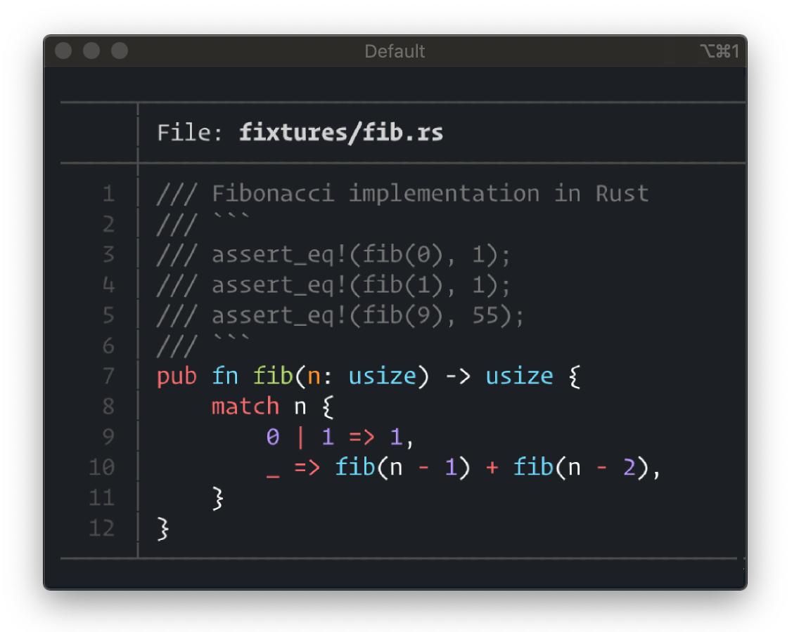

# prettyprint 

[](https://docs.rs/prettyprint/)


Syntax highlighting library with batteries included.

> :warning: For new projects, you might want to use [`bat`](https://github.com/sharkdp/bat/) instead, 
> which can be used as a library now. `prettyprint` is in maintenance mode now, which means it will 
> not see any major updates anymore, but pull requests will still be reviewed and dependencies will 
> be kept up-to-date for the time being. You might want consider migrating away, though.

## Quick start



The above output was created with the following code:

```rust
let printer = PrettyPrinter::default()
    .language("rust")
    .build()?;

printer.file("fixtures/fib.rs")?;
```

Note that `prettyprint` is a [builder](https://github.com/rust-unofficial/patterns/blob/master/patterns/builder.md) and can be customized. For example, if you don't like the grid or the header, you can disable those:

```rust
let printer = PrettyPrinter::default()
    .header(false)
    .grid(false)
    .language("ruby")
    .build()?;

let example = r#"
def fib(n)        
    return 1 if n <= 1
    fib(n-1) + fib(n-2)
end
"#;
printer.string_with_header(example, "fib.rb")?;
```

"What!? It can also print strings, Matthias? That's insane."  
It's true. You're welcome.

## Installation

Add this to your `Cargo.toml`:

```TOML
prettyprint = "*"
```

## But why?

[`syntect`](https://github.com/trishume/syntect/) is a great package for highlighting text.  
When writing a command-line tool that prints text however, you might be looking for some additional functionality.

* Line numbers
* More built-in color-themes
* Automatic pagination
* Proper terminal handling
* Showing non-printable characters
* File headers
* Windows support

`prettyprint` offers all of this in one crate (thanks to [bat](https://github.com/sharkdp/bat/)).  

## Known limitations

* Doesn't run on `no-std` targets. I don't plan to support those.

## Credits

`prettyprint` is simply a fork of [`bat`](https://github.com/sharkdp/bat/), with some functionality stripped out and bundled up as a library. 
I built it, because [I needed it](https://github.com/sharkdp/bat/issues/423) for [cargo-inspect](https://github.com/mre/cargo-inspect/).
All credits go to the original authors.
